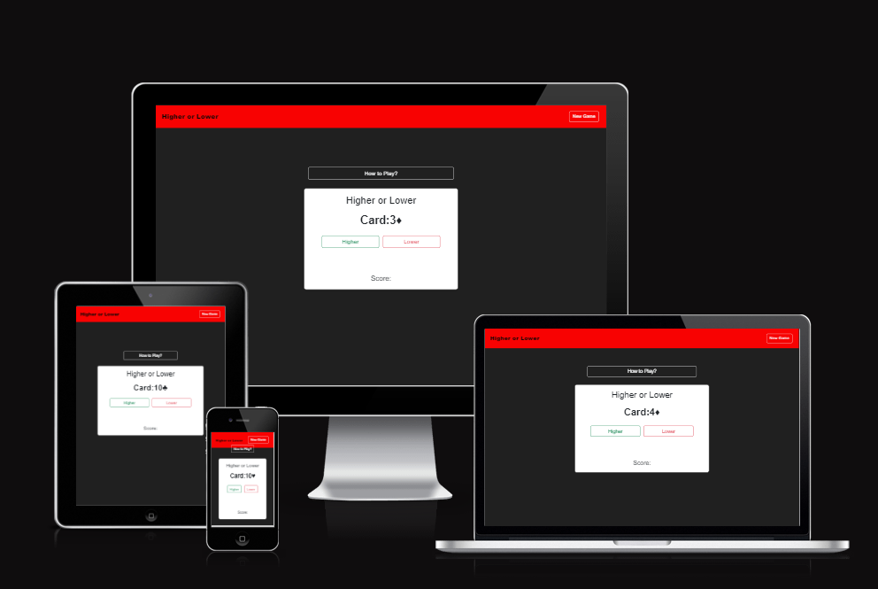

Higher to Lower

Higher and Lower is a game card game where the player has to choose card after the current card dispalyed will be higher or lower. This is achived by using javascript.

[View Higher or Lower here](https://rhystyler112.github.io/Interactive-Front-End-Development///)

## Table of Contents

### [User Experience (UX)](#user-experience-ux-1)
* [User Stories](#user-stories)
### [Design](#design-1)
### [Features](#features)
* [Existing Features](#existing-features)
### [Features Left to Implement](#features-left-to-implement-1)
### [Technologies Used](#technologies-used-1)
### [Frameworks, Libraries & Programs Used](#frameworks-libraries--programs-used-1)
### [Testing](#testing-1)
* [Validation Results](#validation-results)
* [Manual Testing](#manual-testing)
* [Lighthouse Report](#lighthouse-report)
### [Deployment and local development](#deployment-and-local-development-1)
* [GitHub Pages](#github-pages)
* [Forking the GitHub Repository](#forking-the-github-repository)
* [Local Clone](#local-clone)
### [Credits](#credits-1)
### [Acknowledgements](#acknowledgements-1)
---

## User Experience (UX)

### User Stories

 * First-time visitor goals
    * 
    * 
    * 
 * Returning visitor goals
    * 
    * 
    * 

 * Frequent user goals
    * 
    * 

- - -

## Design

 * Colour Scheme
    * Primary colours used on the website: 

 * Typography
    * 

 * Wireframes
    * 
    
    

    

    
Mobile
    

    

    

    

    
Desktop
    

    
---

## Features

* 
* 
* 

### Existing Features

* Navigation bar
    * 
    *

* Hero Image
    * 

* Section one, 'New Gane'
    * 

* Section two, 'How to Play?'
   * 

* The Card
    * 

* Message
    * 

* The Score
    * 

---

## Features Left to Implement

* 
* 
* 

---

## Technologies Used

 * [HTML5](https://en.wikipedia.org/wiki/HTML5)
 * [CSS3](https://en.wikipedia.org/wiki/CSS)
 * [Bootstrap](https://getbootstrap.com/)
 * [JavaScript](https://en.wikipedia.org/wiki/JavaScript)

---

## Frameworks, Libraries & Programs Used

 * [Gitpod](https://www.gitpod.io/)
    * To write the code.
 * [Git](https://git-scm.com/)
    * for vesion control.
 * [Github](https://github.com/)
    * Deployment of the website and storing the files online.
* [Am I Responsive](https://ui.dev/amiresponsive)
    * Mockup picture for the README file.
 
---

## Testing

---

## Deployment and local development

### GitHub Pages

GitHub Pages used to deploy live version of the website.
1. Log in to GitHub and locate [GitHub Repository Interactive-Front-End-Development](https://github.com/RhysTyler112/Interactive-Front-End-Development/settings/pages)
2. At the top of the Repository(not the main navigation) locate "Settings" button on the menu.
3. Scroll down the Settings page until you locate "GitHub Pages".
4. Under "Source", click the dropdown menu "None" and select "Main" and click "Save".
5. The page will automatically refresh.
6. Scroll back to locate the now-published site [link](https://rhystyler112.github.io/Interactive-Front-End-Development/) in the "GitHub Pages" section.

### Forking the GitHub Repository

By forking the repository, we make a copy of the original repository on our GitHub account to view and change without affecting the original repository by using these steps:

1. Log in to GitHub and locate [GitHub Repository Interactive-Front-End-Development](https://github.com/RhysTyler112/Interactive-Front-End-Development/settings/pages)
2. At the top of the Repository(under the main navigation) locate "Fork" button.
3. Now you should have a copy of the original repository in your GitHub account.

### Local Clone

1. Log in to GitHub and locate [GitHub Repository Interactive-Front-End-Development](https://rhystyler112.github.io/Interactive-Front-End-Development/)
2. Under the repository name click "Clone or download"
3. Click on the code button, select clone with HTTPS, SSH or GitHub CLI and copy the link shown.
4. Open Git Bash
5. Change the current working directory to the location where you want the cloned directory to be made.
6. Type `git clone` and then paste The URL copied in the step 3.
7. Press Enter and your local clone will be created.

---

## Credits

### Code
 * [w3schools](https://www.w3schools.com/) CSS section gave inspiration to the design of the website.
 * The README template was helpfully provided by [Code Institute (template)](https://github.com/Code-Institute-Solutions/SampleREADME)
 * To help make sure I was committing and pushing my work correctly using [Git Cheat Code](https://education.github.com/git-cheat-sheet-education.pdf)

### Content

 * All content was written by the developer.
 * [Color contrast checker](https://coolors.co/contrast-checker/112a46-acc8e5) was used to decide which colors would be used for the website.

### Media 

 * [Unsplash](https://unsplash.com/) free stock photos, royalty free images.
 * [Imageresizer](https://imageresizer.com//) Resizing images.
---

## Acknowledgements

 * My mentor Mitko Bachvarov provided helpful feedback and a link to the Flexbox guide.
 * Slack community for encouragement and information.