Higher to Lower

Higher and Lower is a game card game where the player has to choose card after the current card dispalyed will be higher or lower. This is achived by using javascript.

[View Higher or Lower here](https://rhystyler112.github.io/Interactive-Front-End-Development///)

## Table of Contents

### [User Experience (UX)](#user-experience-ux-1)
* [User Stories](#user-stories)
### [Design](#design-1)
### [Features](#features)
* [Existing Features](#existing-features)
### [Features Left to Implement](#features-left-to-implement-1)
### [Technologies Used](#technologies-used-1)
### [Frameworks, Libraries & Programs Used](#frameworks-libraries--programs-used-1)
### [Testing](#testing-1)
* [Validation Results](#validation-results)
* [Manual Testing](#manual-testing)
* [Lighthouse Report](#lighthouse-report)
### [Deployment and local development](#deployment-and-local-development-1)
* [GitHub Pages](#github-pages)
* [Forking the GitHub Repository](#forking-the-github-repository)
* [Local Clone](#local-clone)
### [Credits](#credits-1)
### [Acknowledgements](#acknowledgements-1)
---

## User Experience (UX)

### User Stories

 * First-time visitor goals
    * Understanding the rules so they are able to play the game.
    * Easily navigate in which buttons choose higher or lower and create a new game. 
    * Know where to see their current higher score.
 * Returning visitor goals
    * Able to play without looking at the rules
    * Experince all of the end game like win, lose, tie

 * Frequent user goals
    * Compete with themselves to beat thier highscore or the top score of 52.

- - -

## Design

 * Colour Scheme
    * Primary colours used on the website: 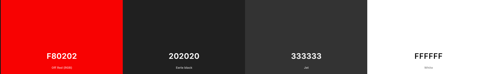

 * Typography
    * Normal fonts was used during this project as not special fonts were needed

 * Wireframes
    * 
    
    

    

    
Mobile
    

    

    

    

    
Tablet
    

    

    

    

    
Desktop
    

    
---

## Features

* Higher or Lower Game: Players guess if the next card will be higher or lower in value than the current card.
* Score Tracking: Player's score is updated based on correct or incorrect guesses.
* Simple UI: Clean layout with interactive buttons to make higher or lower guesses.
* Rules Display: Clear explanation of how to play the game.
* Game Reset: Option to start a new game after a loss or completion.
* Message to display if guess was correct and win condtion that was activated.

### Existing Features

* Navigation bar
    * It is featured and fixed on on the page
    * Includes main title of the site and the new game button

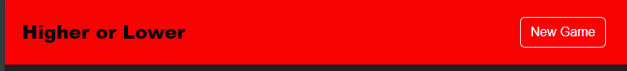

* Section one, 'New Game'
    * Allows the player to start a new game and reset all scores and cards used back to 0.
    * This could happen after a win, lose or tie.

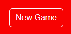

* Section two, 'How to Play?'
   * This is a button with lunches a modal box with the rules
   * Can be closed and hidden away so it doesn't take up screen space and distract the user.
   * Displays all the facts and knowledge a user will need to play the game

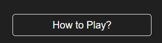
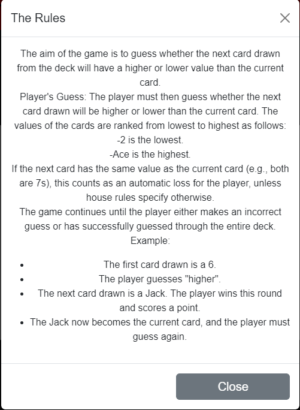

* The Card
    * Depslays the current card number and suit so the user can make thier guess.

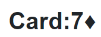

* Message
    * This informs the user the outcome of their action
    * Correct message
    * Incorrect message and what the next card is
    * If incorrect how many attpemts they have left
    * When they have won or lost

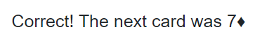

* The Score
    *  Shows the user their current score of correct guess they have made
    *  Max can be 52 due to 52 cards in a deck

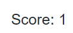

---

## Features Left to Implement

* Create and Interative High Score
* Multiply the number of card by having more than 1 deck avaviable

---

## Technologies Used

 * [HTML5](https://en.wikipedia.org/wiki/HTML5)
 * [CSS3](https://en.wikipedia.org/wiki/CSS)
 * [Bootstrap](https://getbootstrap.com/)
 * [JavaScript](https://en.wikipedia.org/wiki/JavaScript)

---

## Frameworks, Libraries & Programs Used

 * [Gitpod](https://www.gitpod.io/)
    * To write the code.
 * [Git](https://git-scm.com/)
    * for vesion control.
 * [Github](https://github.com/)
    * Deployment of the website and storing the files online.
* [Am I Responsive](https://ui.dev/amiresponsive)
    * Mockup picture for the README file.
 
---

## Testing

The W3C Markup Validator and W3C CSS Validator services were used to validate every 

 * [W3C Markup Validator](https://validator.w3.org/)
 * [W3C CSS Validator](https://jigsaw.w3.org/css-validator/)

### Validation results

index.html

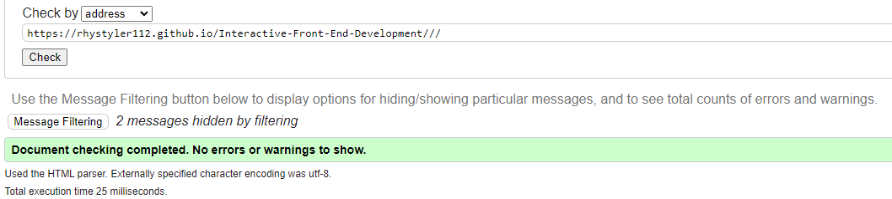

style.css

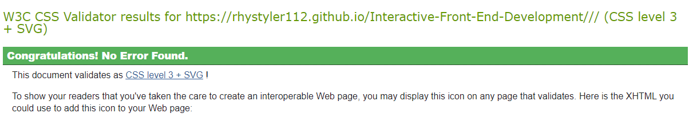

---

### Manual Testing

* The website was tested on Google Chrome, Microsoft Edge, and Opera browsers.
* The website was viewed on a desktop computer, tablet, and iphone 13.
* Family and friends were asked to review the website for a better understanding of the user experience.
* Dev Tools was used to test how the site looks on various screen sizes.

### Bugs and Fixes

*  Bug: There's was no handling for when the current card and the next card are of the same rank. This could be confusing for players.-Fix: Add an explicit check for when the cards are tied and provide feedback to the player.

*   Bug: After the last card is drawn, there was no clear message or prompt for the player when the game is over. Instead, it only checks whether all cards have been played, but doesn't make the outcome clear enough for the player. -Fix: Add more robust game-ending feedback for both winning and losing conditions.

*   Bug: After the game ends (when the player wins or loses), the higher and lower buttons are disabled. However, if the player keeps pressing these buttons rapidly right before they are disabled, there could be additional unwanted guesses being processed. -Fix: Add a check at the beginning of the guess() function to prevent further guesses once the game is over. 

* Bug: Is that the same card can be displayed more than once meaning there would be more than 52 card displayed deafting the object of the game. -Fix: A empty array was made to add the cards that had shown so math.random would not choice it again and function checkGameEnd() if 52 cards had been shown the correct win codtion would be displayed to the user. 
*   No known bugs

### Lighthouse Report

#### Mobile analysis

Main page

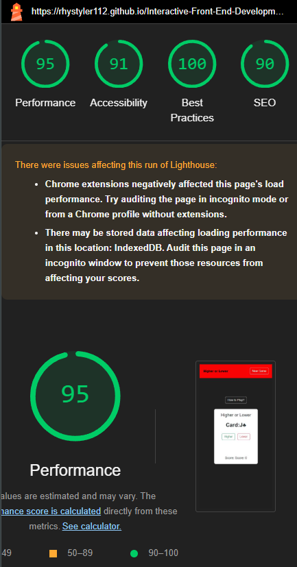

#### Desktop analysis

Main page

---

## Deployment and local development

### GitHub Pages

GitHub Pages used to deploy live version of the website.
1. Log in to GitHub and locate [GitHub Repository Interactive-Front-End-Development](https://github.com/RhysTyler112/Interactive-Front-End-Development/settings/pages)
2. At the top of the Repository(not the main navigation) locate "Settings" button on the menu.
3. Scroll down the Settings page until you locate "GitHub Pages".
4. Under "Source", click the dropdown menu "None" and select "Main" and click "Save".
5. The page will automatically refresh.
6. Scroll back to locate the now-published site [link](https://rhystyler112.github.io/Interactive-Front-End-Development/) in the "GitHub Pages" section.

### Forking the GitHub Repository

By forking the repository, we make a copy of the original repository on our GitHub account to view and change without affecting the original repository by using these steps:

1. Log in to GitHub and locate [GitHub Repository Interactive-Front-End-Development](https://github.com/RhysTyler112/Interactive-Front-End-Development/settings/pages)
2. At the top of the Repository(under the main navigation) locate "Fork" button.
3. Now you should have a copy of the original repository in your GitHub account.

### Local Clone

1. Log in to GitHub and locate [GitHub Repository Interactive-Front-End-Development](https://rhystyler112.github.io/Interactive-Front-End-Development/)
2. Under the repository name click "Clone or download"
3. Click on the code button, select clone with HTTPS, SSH or GitHub CLI and copy the link shown.
4. Open Git Bash
5. Change the current working directory to the location where you want the cloned directory to be made.
6. Type `git clone` and then paste The URL copied in the step 3.
7. Press Enter and your local clone will be created.

---

## Credits

### Code
 * [w3schools](https://www.w3schools.com/) was used for inspiration to the design of the website and the tips on my script code.
 * The README template was helpfully provided by [Code Institute (template)](https://github.com/Code-Institute-Solutions/SampleREADME)
 * To help make sure I was committing and pushing my work correctly using [Git Cheat Code](https://education.github.com/git-cheat-sheet-education.pdf)

### Content

 * All content was written by the developer.
 * [Color contrast checker](https://coolors.co/contrast-checker/112a46-acc8e5) was used to decide which colors would be used for the website.

### Media 

 * No external images were needed in this project
---

## Acknowledgements

 * My mentor Mitko Bachvarov provided helpful feedback and a link to the Flexbox guide.
 * Slack community for encouragement and information.